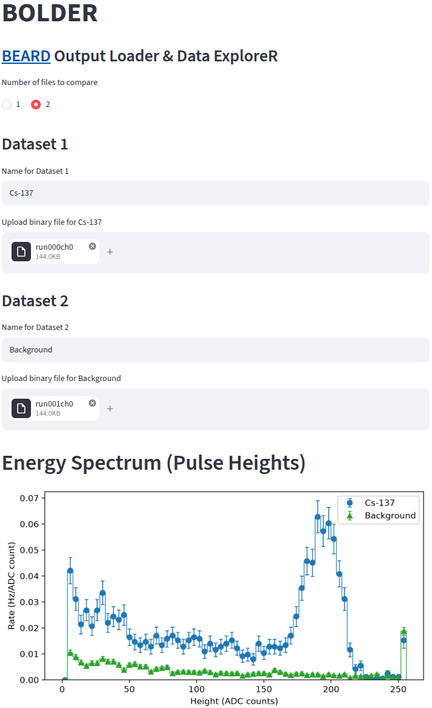

[](.)
[](breadboard)
[](firmware)
[](#local-rendering)

# Binary Output Data

## Online Rendering

Up to two output files `run???ch?` in the micro SD card can be uploaded to [BOLDER - BEARD Output Loader & Data ExploreR](https://bolder.streamlit.app/) for users to explore their energy spectra, trigger rates, and waveforms in a web browser without any programming. One dataset could be the background spectrum and another one could be an energy spectrum from a radioactive source.



## Local Rendering

For users who want to explore the data mannually, a Python script [b2r.py](b2r.py) is provided as an example to show how one can convert the binary file (`run???ch?`) to [ROOT] format. It uses the [uproot] python package to create a ROOT [TTree] to hold waveform data in `run???ch?.root`. In a Mac or Linux terminal, one can run the following command to convert a binary file to ROOT format:

```sh
python -m venv .venv
source .venv/bin/activate
pip install uproot
cd /path/to/b2r.py
python b2r.py /path/to/run???ch?
deactivate
```

The generated ROOT file can be opened and inspected using the following command and code if you have [ROOT] installed.

```sh
root run004ch0.root
(TFile *) 0x1015917e0
root [1] .ls
TFile**         run004ch0.root
 TFile*         run004ch0.root
  KEY: TTree    t;1
root [2] t->Show(0)
======> EVENT:0
 n               = 64
 ms              = 90
 us              = 0, 
                  2, 4, 6, 8, 10, 
                  12, 14, 16, 18, 20, 
                  22, 24, 26, 28, 30, 
                  32, 34, 36, 38
 s               = 5, 
                  4, 5, 4, 4, 4, 4, 4, 141, 88, 59, 
                  45, 36, 31, 28, 26, 24, 24, 22, 21
 h               = 141
 ```

 where, `n` shows the total number of waveform samples saved in each event, `ms` is the time stamp of each event in the unit of ms, `us` is the time of each waveform sample in the unit of us, `s` is an array of waveform samples in ADC counts, `h` is the height of the pulse in the waveform.

 `t->Draw("h")` gives the energy spectrum.

 `t->Draw("s:us", "", "l", 10, 2)` draws 10 consecutive waveforms starting from event 2.

 [ROOT]: https://root.cern
 [uproot]: https://pypi.org/project/uproot
 [TTree]: https://root.cern.ch/root/htmldoc/guides/users-guide/Trees.html